<div align="center";>
<h1> Analyze apk files </h1>
</div>

> [!NOTE]
> 
> Today, we will explore the process of analyzing APK files, a crucial step in understanding the inner workings of Android applications, ensuring their security, and optimizing their performance.


---------


<div align="center";>
<h3> Slide 1</h3>
</div>

---------


> From a perspective: analyzing the source code in the apk file

:books: Outline
  - [x] Android Platform Overview
    - [ ] The file hierarchy
    - [ ] The Android security model
  - [ ] Understanding Dalvik and ART
    - [x] Dalvik VM
    - [x] ART
    - [ ] The bytecode set
  - [ ] File formats and APIs
    - [ ] DEX
    - [ ] ODEX
    - [ ] OAT
    - [ ] VDEX
    - [ ] ART
    - [ ] ELF
    - [x] APK file
    - [x] API
  - [ ] OWASP Mobile Application Security
    - [ ] MASVS 
    - [ ] MASTG
  - [x] Malware behavior patterns
    - [x] Inital access
    - [x] Privilege escalation
    - [x] Persistence
    - [x] Impact
    - [x] Collection
    - [x] Defence evasion
    - [ ] (See more) Mitre attack Mobile
  - [x] The analysis workflow
    - [x] Environment Setup
    - [x] Sample acquisition
    - [x] Reviewing the app manifest
    - [x] Decompilation, Disassembly and Code Review
    - [x] Static analysis (--> automation)
    - [x] Dynamic Analysis and Behavior
    - [x] Runtime Instrumentation
    - [x] Vulnerability Identification
    - [x] Debugging
    - [x] Reporting and Remediation
  - [x] Demo
    - [x] Mobsf
      - [x] static analysis
      - [ ] dynamic analysis
    - [x] jadx, jadx-gui
  - [x] References

---------


<div align="center";>
<h3> Slide 2</h3>
</div>

---------

## Android platform Overview

Native Android applications are written mainly in Java or Kotlin. 

The Android SDK tools compile the code along with any data and resource files into an APK or an Android App Bundle. 

The compiled application is in a specific format, specified by the extension .apk. 

That is, an Android package is an archive file containing multiple application files and metadata.


-----
<div align="center";>
<h3> Slide 3</h3>
</div>

-----

## Understanding Dalvik and ART

- Dalvik VM (DVM)
- Android runtime (ART)


-----
<div align="center";>
<h3> Slide 4</h3>
</div>


## File formats and APIs

### APK Files

APK files are archive files based on the JAR format

APK files can be unpacked using any software supporting ZIP-compressed files

APK files contain the following files:

- `res`
- `META-INF`
  - `MANIFEST.MF`
  - `<name>.RSA`
  - `<name>.SF`
- `AndroidManifest.xml` :star:
  - Basic app information 
  - App components and the corresponding types
  - Required permissions 
  - Hardware and software features that the app needs
  - Information about the supported Android SDK
- `classes.dex`
- `resources.arsc`


- Example: 
```
- Rename apk to zip: #mv app-debug.apk app-debug.zip
- Unzip #unzip app-debug.zip
```
- Result:

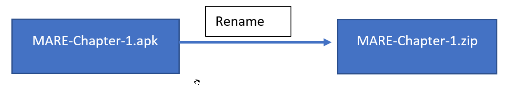

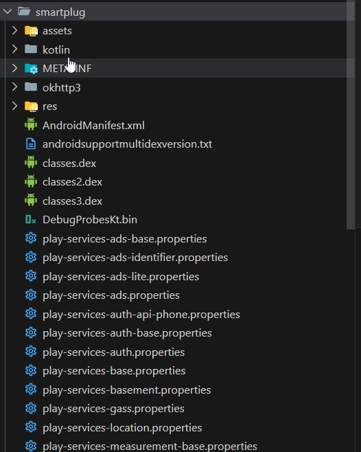


-------

<div align="center";>
<h3> Slide 5</h3>
</div>

------

### APIs

Android implements its own APIs in order to let programs interact with the OS to achieve their goals. 

In addition, some introduced classes and APIs are new and aim to provide access to the unique features implemented in Android. 

Here are some other examples of APIs and their classes, with self-explanatory names that can be commonly seen in malware:

- SmsManager
  - sendTextMessage
- ActivityManager
  - GetRunningServices
  - getRunningAppProcesses
- PackageManager
  - GetInstalledApplications
  - getInstalledPackages
- DevicePolicyManager
  - LockNow
  - reboot
- Camera
  - TakePicture
- DownloadManager
  - enqueue
- DownloadManager.Request
  - setDestinationUri


## Malware behavior patterns

- Initial access: 
  - The most common ways malware gets access to devices are the following:
    - Google Play
    - Third-party markets and sideloading
    - Malicious ads and exploits


  - Similar design: The app may look similar and have a similar name to some other well-known, legal application.
  - Fake reviews: To make the app look authentic and not suspicious.
  - Anti-detection techniques: To bypass automatic malware scanners and prolong the hosting.
  - Malicious update: The original application uploaded to the store is clean, but its update contains hidden malicious functionality.
  - Luring description: Promises free or forbidden content, easy money, and so on.

- Privilege escalation:

  - The next stage is to obtain all required permissions. Apart from the rooting options already discussed, it is possible for malware to abuse so-called administrative permissions

  - Originally designed for enterprise use cases to remotely administrate the mobile devices of employees, they can offer malware powerful capabilities, including the ability to wipe important data. Usually, the easiest way to get permissions is to keep asking the user and don’t stop until they are granted

- Persistence:

  - The most common places where malware installs itself once it gets executed are the following:
    - /data/data: Standard paths intended to be used for all Android applications. This approach
poses a threat to attackers, as it is relatively easy to remediate such threats.
    - /system/(app|priv-app|lib|bin|xbin|etc): These paths require malware to use rooting exploits to get access to them. This makes it harder for the user to identify and delete the threat.

- Impact
- Collection
- Defence evasion
  - There are multiple anti-analysis techniques that mobile malware can incorporate in order to protect
itself, including the following:
    - An inaccessible location: A previously mentioned technique where malware uses rooting exploits to allow it to deploy itself in locations that are not accessible with standard user privileges. Another option is to overwrite existing system apps.
    - Detecting privilege revocation: Multiple techniques are used to scare the user when permissions are revoked in an attempt to prevent it.
    - Detecting antivirus solutions: In this case, malware keeps looking for files associated with known antivirus products and once detected, may display a nag window asking for its uninstallation. These kinds of messages are shown in a loop and prevent the victim from using the device properly until the requested action is taken.


    - Emulator and sandbox detection: Here, the malware checks whether it is being executed on the emulated environment or not. There are multiple ways it can be done: by checking the presence of certain system files or values inside them, such as IMEI and IMSI, build information, various product-related values, as well as the phone numbers used. In this case, malware behaves differently depending on the result to tamper with automatic and manual analysis. Another popular simple technique used to bypass basic sandboxes with an execution time limit is to sleep or perform benign actions for a certain period of time.
    - Icon hiding: The idea here is that the user can’t easily uninstall the app using an icon. For example, a transparent image with no visible app name can be used.
    - Multiple copies: Malware can install itself in various locations in the hope that some of them will be missed. In addition, infecting the Zygote process allows malware to create multiple copies in the memory.
    - Code packing or obfuscation: As many Android programs are written in Java, the same code protection solutions can also be used here. Multiple commercial options are available on the market at the moment. 


-----

<div align="center";>
<h3> Slide ...</h3>
</div>


-----

## The analysis workflow (Tactics, Techniques and Tools)


------

### 1. Environment Setup
> Set up a suitable environment for mobile app reverse engineering, including the installation of relevant tools, virtualized, or physical devices for testing purposes.


- Tools for the reverse engineering of mobile (Android and iOS) applications
- Setting up an environment for reverse engineering
- Installing and setting up the tools for reverse engineering
- Setting up Mobexler (a mobile application penetration testing platform)

> [!NOTE]
> 
> Requirement 
> 
> VirtualBox or VMware


- Tool
  - `apktool`
  - `JADX – Dex-to-Java decompiler`
  - `smali/baksmali`
  - `strings`
  - `Ghidra`
  - `Radare`, `Radare2`
  - `Mobexler virtual machine`
  - ...

-----

<div align="center";>
<h3> Slide ...</h3>
</div>


-----

### 2. Sample acquisition

:books: Sample/App acquisition: 
> Quite often, the sample is already provided by the customer or is easily downloadable from a third-party website. However, sometimes it is required to obtain samples from **Google Play**. There are multiple ways this can be done: by using dedicated tools such as APK Downloader or by installing an app on the emulator and then getting its APK file from the disk. If optimized ART files are provided (particularly OAT), make sure you have all the system files required to extract the DEX bytecode, for example, the boot.oat file.

- Downloading the app from official app stores: https://apkpure.com/
- Extracting the APK file from an Android device

-----

<div align="center";>
<h3> Slide ...</h3>
</div>


-----


### 3. Reviewing the app manifest
For apps, it is worth spending some time reviewing the manifest, as it can give you valuable insight into the sample’s functionality, in particular, the following:
- The permissions requested
- The components available
- The main activities and the Application’s subclass from the android:name attribute of the `<application>` element (if present)


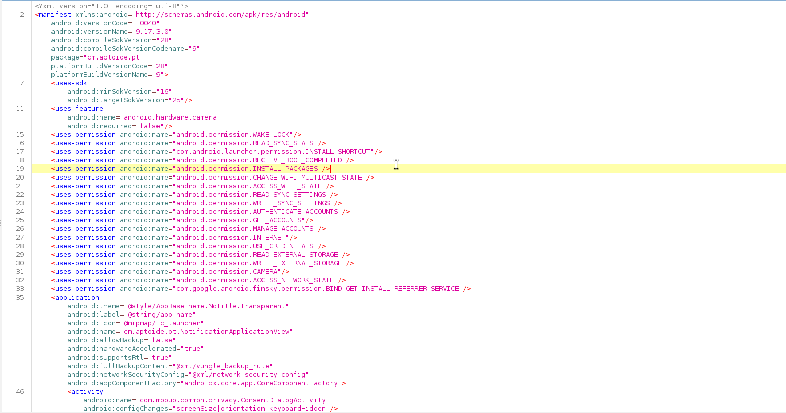

-----

<div align="center";>
<h3> Slide ...</h3>
</div>


-----

### 4. Decompilation, Disassembly, and Code Review

> It always makes sense to try to get the decompiled source
code, as it is usually much easier to read it and perform dynamic analysis, including alteration if necessary. If decompilation doesn’t work and some anti-reverse-engineering technique is expected, then the code can be disassembled so that the tampering logic can be amended. 

> Use tools like **APKTool** or **JADX** for Android and tools like **Hopper**, **Ghidra**, and **IDA Pro** for iOS to decompile or disassemble the app's code and review the extracted source code for vulnerabilities, hard-coded values, or weak security implementations.
>
> :pencil2: Hopper and IDA Pro not free

> Deobfuscation and decryption
> 
> If it has been confirmed that the sample is obfuscated, at
first, it’s worth trying to figure out whether it is a known Java solution and whether any ready deobfuscators exist. 


**Decompilation**: This is the process of translating a file from a low-level language to a higher level language. The tool used to perform decompilation is called a decompiler. A decompiler takes a binary program file and changes this program into a higher-level structured language. The following diagram illustrates the decompilation process:


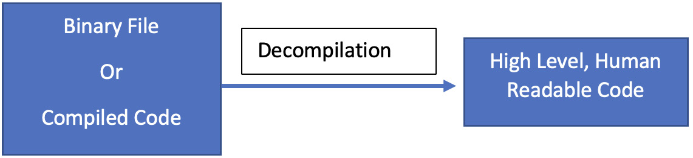


**Disassembling**: This is the process of transforming machine code (in an object code binary file) into a human-readable mnemonic representation called assembly language. The tool used to perform disassembly is called a disassembler as it does the opposite of what an assembler does. The following diagram illustrates the disassembly process:


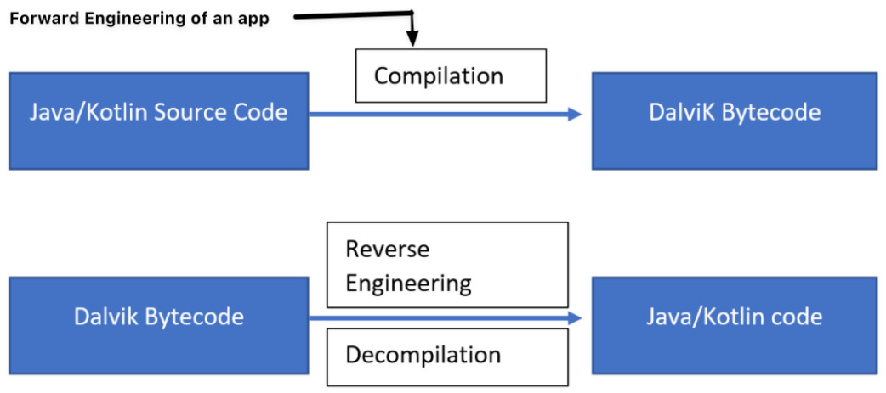


-----

<div align="center";>
<h3> Slide ...</h3>
</div>


-----


### 5. Static analysis

> Analyze the app's source code to understand its architecture, identify potential security flaws, identify API endpoints, and examine data handling mechanisms. Look for issues such as improper data validation, insecure data storage, or weak cryptography implementations.

> Generally, static analysis of bytecode malware involves either disassembling it and digging into the
bytecode instructions or decompiling to the original language and exploring the source code. In many
cases, the latter approach is preferable wherever possible, as reading the human-friendly code reduces
the time the analysis takes. The former approach is often used when decompiling doesn’t work for
whatever reason, such as a lack of up-to-date tools or because of anti-reverse-engineering techniques
implemented in the sample.

- Disassembling and data extraction
  - These tools aim to restore Dalvik assembly from the compiled bytecode:
    - Smali or Baksmali
    - Apktool
    - aapt
    - oat2dex
    - vdexExtractor
    - LIEF
    - Androguard
  - Decompiling
    - JADX
    - AndroChef
    - JEB decompiler
    - dex2jar 
    - Ghidra

-----

<div align="center";>
<h3> Slide ...</h3>
</div>


-----

### 6. Dynamic Analysis and Behavioral analysis
> Run the app on a controlled device or virtualization platform while monitoring its behavior. Use tools like Frida or debugging frameworks to intercept function calls, inspect memory, and observe network traffic for potential vulnerabilities or suspicious activity.


> It may make sense to execute a sample in the emulator with your behavioral analysis tools of choice enabled to quickly get an idea of the potential functionality. If an emulator detection technique is implemented, it’s usually pretty straightforward to identify it in the code and amend the sample to exclude these checks.


Effective dynamic analysis requires either some sort of emulation or remote debugging, as many
mobile devices tend to have relatively small native screens and basic input capabilities.

- Android Debug Bridge (ADB) is a versatile command-line tool that lets users interact with mobile
devices from the PC, providing a variety of actions. It is a part of Android SDK Platform Tools and
consists of three parts:
- Emulators
  - Android Emulator
- VMWare, VirtualBox, or QEMU

Behavioral analysis and tracing
As with many other platforms, the **fsmon** tool can be used to monitor file operations on Android.
Here is an example of it being used to detect the creation of a new file:

In terms of APIs, an **AppMon** solution includes a set of components to intercept and manipulate API
calls. It is based on the **Frida** project, which also provides its own versatile tools, such as **frida-trace** (working together with frida-server). One more tool based on Frida is Objection, which provides access to multiple options including various memory-related tasks, heap manipulation, and the
execution of custom scripts

Speaking about recording network traffic, the standard **tcpdump** tool can run on the device for
this purpose and is generally the easiest-to-use solution. **Wireshark** creators also supply a tool called **androiddump** to provide interfaces to capture on Android devices (which generally needs to be built separately). In addition, as long as the malicious sample is decompiled, it also becomes possible to embed various libraries intercepting API calls, for example, **AndroidSnooper** to intercept HTTP traffic.


-----

<div align="center";>
<h3> Slide ...</h3>
</div>


-----

### 7. Runtime Instrumentation
> Utilize tools like **Frida** or **Xposed** to dynamically modify the app's behavior during runtime. This can involve injecting custom code for function interception, data manipulation, or behavior modification for analysis purposes.


-----


<div align="center";>
<h3> Slide ...</h3>
</div>


-----


### 8. Vulnerability Identification
> Employ various techniques, such as fuzzing, input validation, and boundary testing, to identify common security vulnerabilities like SQL injection, insecure data storage, insecure communication, or improper access control.


-----

<div align="center";>
<h3> Slide ...</h3>
</div>


-----


### 9. Debugging
> Debugging: This is a technique that allows the user to view and modify the state of a program at runtime. The following diagram illustrates the debugging process:

> Sometimes, it’s hard to understand certain blocks of functionality, particularly ones where malware heavily interacts with the operating system. In this case, proper step-by-step debugging may be required to speed up the analysis. Always use emulators supporting snapshot creation, so that it is possible to go back and quickly reproduce the same situation as many times as necessary.

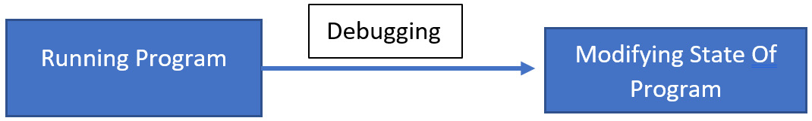

-----

<div align="center";>
<h3> Slide ...</h3>
</div>


-----


### 10. Reporting and Remediation
> Document the findings, including identified vulnerabilities, weaknesses, or potential areas of improvement. Share the report with relevant stakeholders, such as developers or project managers, and provide recommendations for remediation and enhancing the app's security.


-----

<div align="center";>
<h3> Slide ...</h3>
</div>

-----


## Demo

### Setting Up a Mobile App Reverse Engineering Environment Using Modern Tools


----

<div align="center";>
<h3> Slide ...</h3>
</div>


### MobSF demo

:books: Static analysis - During a static analysis of APK, MobSF performs the following tasks:
- Decompiling and extracting content such as hardcoded certificates/key stores
- Converting AXML to XML
- Extracting and analyzing manifest data
- Creating the Java code
- Converting DEX to SMALI
- Extracting strings


:books: Static analysis report

- file apk information and app information

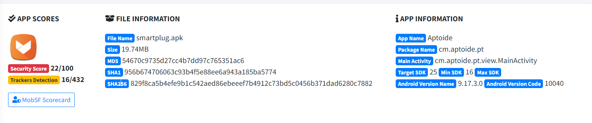

- activities, services, ... 

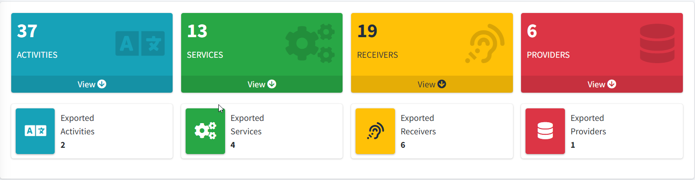

- decompiled code


- signer certificate

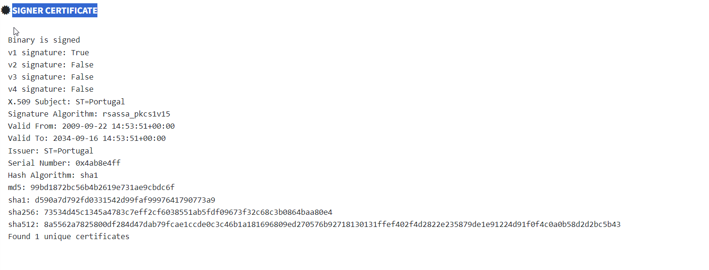

- application permissions


- android api

- browsable activities


- network security


- certificate analysis


- manifest analysis


- code analysis


- shared library binary analysis


- niap analysis v1.3


- file analysis


- apkid analysis


- quark analysis


- abused permissions


- server locations


- domain malware check


- urls


- firebase database


- emails


- trackers


- .... 


----

<div align="center";>
<h3> Slide ...</h3>
</div>

### Mobsf dynamic analyzer

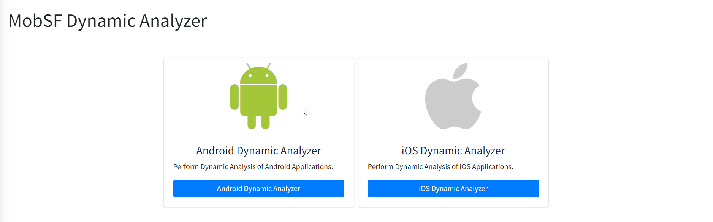


### Jadx and Jadx-gui

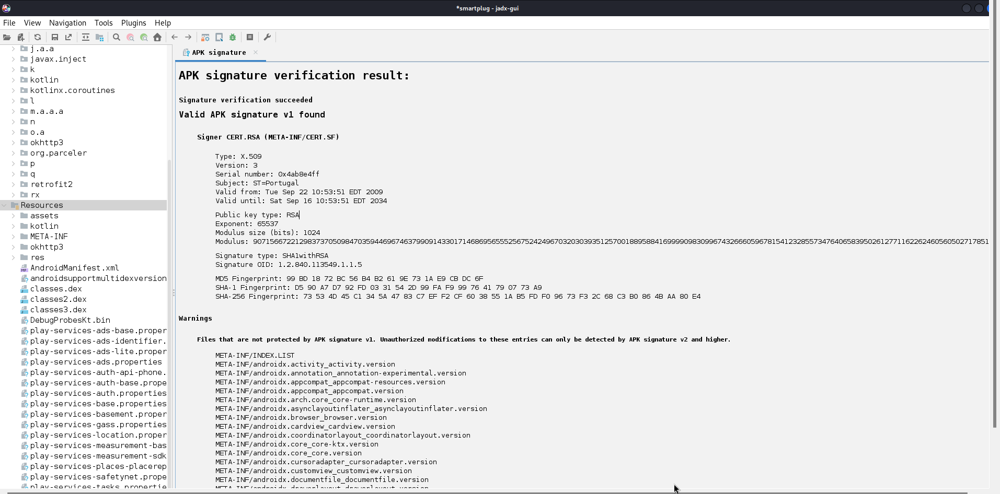

-----

<div align="center";>
<h3> Slide ...</h3>
</div>


## References 

- https://mas.owasp.org/
- https://attack.mitre.org/matrices/mobile/


------